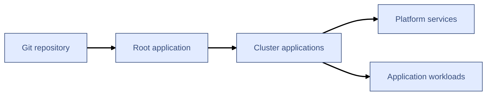
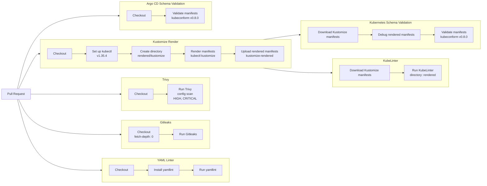

# Overview

Argo CD GitOps repository built using App of Apps pattern with support for multi cluster setups and strong focus on simplicity, manageablility and security. Principle of least priviledge was a leading factor in a design of Argo CD Projects and Kubernetes deployments.

This repository is a part of a bigger infrastructure as code project built with:

- **Terraform** to provision and manage infrastructure.
- **Ansible** to configure VMs and execute Kubespray.
- **Kubespray** to install Kubernetes and base cluster components.
- **Argo CD** which is initially installed by Kubespray to deploy and manage cluster workloads.
- **GitHub Actions** for CI/CD.

## Repository structure

```text
.
├── applications  # Contains Kubernetes manifests and additional configuration files if needed.
│   ├── platform
│   │   └── kube-prometheus-stack
│   │       └── values.yml
│   └── workloads
│       └── website
│           ├── deployment.yml
│           ├── kustomization.yml
│           └── service.yml
├── bootstrap  # Argo CD bootstrap applications. Applied manually on fresh cluster installation.
│   ├── argocd.yml
│   ├── root-aws.yml
│   └── root-home.yml
├── clusters  # Defines cluster specific configuration.
│   ├── aws
│   │   ├── argocd-projects.yml
│   │   ├── kube-prometheus-stack.yml
│   │   └── website.yml
│   └── home
│       ├── argocd-projects.yml
│       ├── kube-prometheus-stack.yml
│       └── website.yml
├── projects  # Argo CD Project manifests. 
│   ├── apps.yml
│   ├── argocd.yml
│   ├── platform.yml
│   └── root.yml
├── README.md
└── schemas  # Kubernetes Custom Resource Definitions (CRD) for Argo CD manifests. Used in Actions by kubeconform.
    ├── application.json
    ├── applicationset.json
    └── appproject.json
```

## Architecture

This repository utilises **App of Apps** pattern and offers support for multiple clusters.



#### App of Apps pattern 

App of Apps allows for automated deployment and configuration of cluster resources with a ***Git repository as a single source of truth***. Continuous repository scans and cluster state comparisons detect configuration drift and trigger reconciliation steps for ensuring parity between repository held configuration and actual state of deployment.

#### Multi-cluster model

This repository assumes that each Kubernetes cluster has its own Argo CD instance and its own root Application. This design choice was made to avoid one central Argo CD instance that manages many remote clusters. This architectural choice aligns with project goal of creating a simple, manageable and secure GitOps setup. Decentralised cluster management minimises potential blast radius of Argo CD or cluster downtime and increases security by eliminating a need for shared cluster credentials while only marginally increasing maintenance cost.

<!-- #### Bootstrap

For this project Argo CD installation is done by Kubespray as part of the infrastructure provisioning managed by the IaC project: **LINK**

The only manual bootstrap step is applying the cluster specific root Application:

```bash
kubectl apply -f bootstrap/root-<cluster>.yml
```

After that, Argo CD takes ownership of the repository's desired state.

Verify:

```bash
kubectl -n argocd get applications
kubectl -n argocd get appprojects
```

The root Application then creates cluster-level child Applications. -->

## CI/CD

This project has a fairly simple but pretty powerful CI pipeline built on top of GitHub Actions that is triggered automatically on new pull request.

The responsibility of this pipeline is restricted to code validation and security checks while deployment is handled by Argo CD.

#### CI workflow



**YAML Linter** - This step uses **yamllint** version 1.38.0 to recursively scan all YAML files in the repository and report any discovered YAML formatting errors.

**Secrets Scan** - **Gitleaks** is used to scan all files in the repository for potential unsecured credentials.

**Security Scan** - Repo security is assessed by Trivy in misconfioguration scanning mode. This scan is restricted to repo files only with no access to Kubernetes cluster.

**Kustomize Render** - Kustomize file file validity is confirmed by **kubectl kustomize** render. Rendered manifests are then uploaded as a GitHub Artifact for further validation by Kubeconform and KubeLinter.

**Manifest Validation** - Kubernetes and Argo CD manifests are validated by **Kubeconform**. Argo CD validation is done with official Argo CD CRDs converted to Kubeconform supported JSON format. 

**Best Practices Scan** - Rendered kustomize files are scanned by KubeLinter to detect misconfiguation and best practice violations.

## Future improvements

1. ApplicationSets for multi cluster configurations.
2. Expanded applications list making better use of the cluster.
3. Inclusion of Helm charts.
4. Documentation improvements.